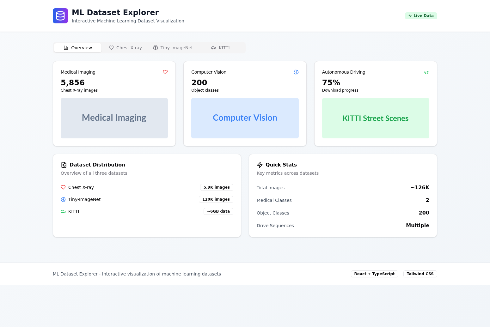

# 🔬 ML Dataset Explorer

🌐 **Live Demo**: https://ml-dataset-explorer-psi.vercel.app/



## 📊 Overview

An interactive web application for exploring and visualizing popular machine learning datasets. Built with modern web technologies to provide researchers, students, and ML practitioners with detailed insights into three major dataset categories: Medical Imaging, Computer Vision, and Autonomous Driving.

## ✨ Features

### 🏥 Medical Imaging - Chest X-ray Dataset
- **5,856 medical images** for pneumonia detection research
- **Interactive distribution charts** showing Normal vs Pneumonia cases (1,583 Normal, 4,273 Pneumonia)
- **Clinical applications** including automated pneumonia detection and medical AI training
- **Real-time statistics** and data insights with expert physician graded quality control

### 🖼️ Computer Vision - Tiny-ImageNet-200
- **120,000 images** across 200 object categories
- **64×64 pixel resolution** optimized for research and benchmarking
- **Training/Validation/Test splits** visualization (100K/10K/10K distribution)
- **CNN architecture testing** and transfer learning experiments
- **Object recognition research** and computer vision benchmarking

### 🚗 Autonomous Driving - KITTI Street Scenes
- **Camera images and LIDAR data** from real driving scenarios in Karlsruhe, Germany
- **Multi-modal sensor data** including stereo cameras and 3D point clouds
- **Drive sequence analysis** for computer vision and autonomous vehicle research
- **Research applications** including stereo vision, optical flow, object detection, and SLAM development

## 🛠️ Tech Stack

- **Frontend**: React 18 + TypeScript
- **Build Tool**: Vite 6
- **Styling**: Tailwind CSS 3.4 with custom animations
- **UI Components**: Radix UI primitives for accessibility
- **Charts**: Recharts for interactive data visualization
- **Icons**: Lucide React icon library
- **Form Handling**: React Hook Form with Zod validation
- **State Management**: React hooks and context
- **Deployment**: Vercel with automatic deployments

## 🚀 Getting Started

### Prerequisites
- Node.js 18+ 
- npm or yarn package manager

### Installation

1. **Clone the repository**
   ```bash
   git clone https://github.com/raimonvibe/ml-dataset-explorer.git
   cd ml-dataset-explorer
   ```

2. **Install dependencies**
   ```bash
   npm install
   ```

3. **Start development server**
   ```bash
   npm run dev
   ```

4. **Open your browser**
   Navigate to `http://localhost:5173`

### Build for Production

```bash
npm run build
npm run preview
```

### Available Scripts

- `npm run dev` - Start development server
- `npm run build` - Build for production
- `npm run lint` - Run ESLint checks
- `npm run preview` - Preview production build

## 📱 Usage

1. **🔍 Explore Dataset Overview** - Get a comprehensive view of all available datasets with key statistics
2. **🏥 Dive into Medical Imaging** - Analyze chest X-ray data for pneumonia detection research with distribution charts
3. **🖼️ Investigate Computer Vision** - Explore Tiny-ImageNet for object recognition tasks with detailed specifications
4. **🚗 Study Autonomous Driving** - Examine KITTI dataset for self-driving car applications with sensor data insights

## 🎯 Use Cases

- **🔬 Research**: Academic research in computer vision, medical imaging, and autonomous systems
- **📚 Education**: Teaching machine learning concepts and dataset analysis techniques
- **🏗️ Development**: Prototyping ML models with well-established benchmark datasets
- **📊 Analysis**: Understanding dataset characteristics, distributions, and research applications
- **🤖 AI Training**: Selecting appropriate datasets for specific machine learning tasks

## 🌟 Key Features

- **📊 Interactive Visualizations** - Dynamic charts and statistics for each dataset
- **🎨 Modern UI/UX** - Clean, responsive design with dark/light theme support
- **⚡ Fast Performance** - Optimized with Vite and modern React patterns
- **♿ Accessibility** - Built with Radix UI for screen reader compatibility
- **📱 Mobile Responsive** - Works seamlessly across all device sizes
- **🔄 Live Data** - Real-time dataset statistics and information

## 🤝 Contributing

Contributions are welcome! Please feel free to submit a Pull Request. For major changes, please open an issue first to discuss what you would like to change.

1. Fork the repository
2. Create your feature branch (`git checkout -b feature/AmazingFeature`)
3. Commit your changes (`git commit -m 'Add some AmazingFeature'`)
4. Push to the branch (`git push origin feature/AmazingFeature`)
5. Open a Pull Request

## 📄 License

This project is open source and available under the [MIT License](LICENSE).

## 🙏 Acknowledgments

- **Chest X-ray Dataset**: NIH Clinical Center for providing medical imaging data
- **Tiny-ImageNet**: Stanford CS231n Course for computer vision research dataset
- **KITTI Dataset**: Karlsruhe Institute of Technology for autonomous driving data
- **React Community**: For the amazing ecosystem of tools and libraries
- **Vercel**: For seamless deployment and hosting

## 📈 Dataset Statistics

| Dataset | Images | Categories | Use Case | Format |
|---------|--------|------------|----------|---------|
| Chest X-ray | 5,856 | 2 (Normal/Pneumonia) | Medical AI | JPEG |
| Tiny-ImageNet | 120,000 | 200 Objects | Computer Vision | 64×64 RGB |
| KITTI | Multiple | Multi-modal | Autonomous Driving | Images + LIDAR |

---

Built with ❤️ for the ML community | [🌐 Live Demo](https://ml-dataset-explorer-psi.vercel.app/)
